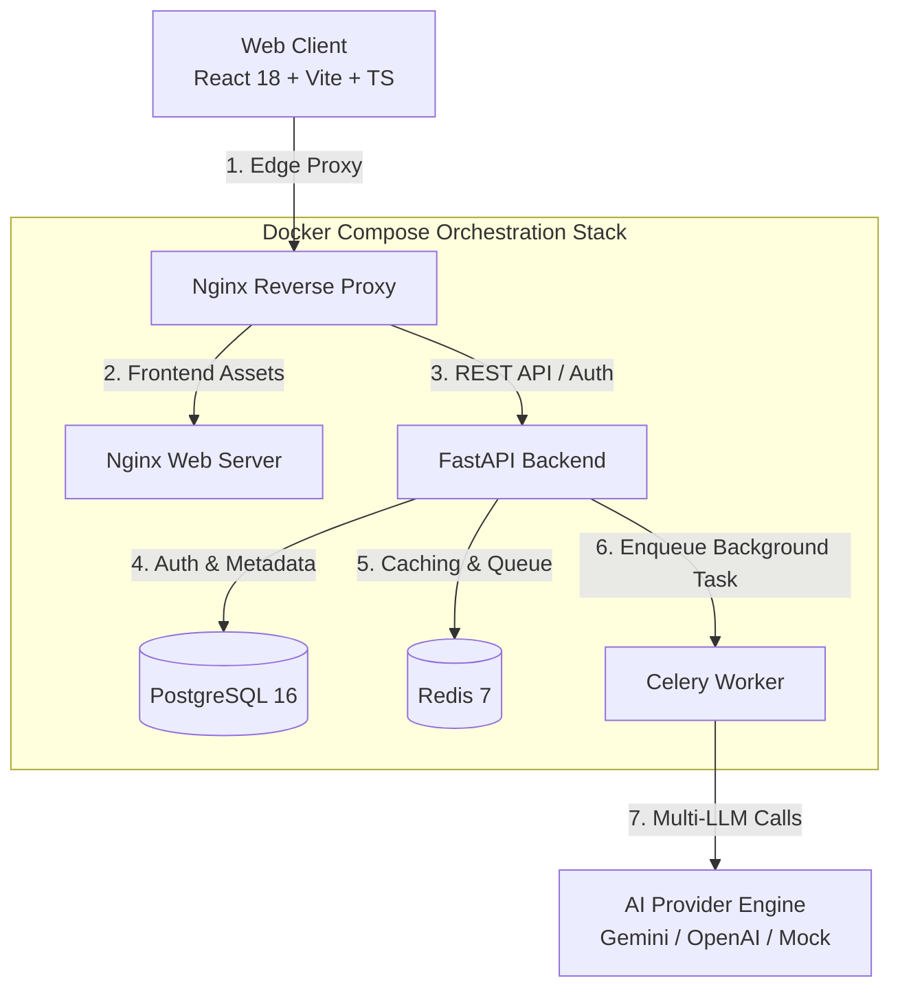

# IssueRadar AI (v1.0.0)

> An enterprise-ready, AI-powered platform that helps open-source contributors discover high-impact GitHub issues matching their skills, experience, and domain interests.

---

## 🌟 Architecture & System Design

IssueRadar AI is built as a **production-ready monorepo** with a clean layered architecture (Router → Service → Repository → Database) ensuring separation of concerns, high throughput, and observability.



---

## 🛠️ Technology Stack

| Layer             | Technology                      | Description                                                       |
| :---------------- | :------------------------------ | :---------------------------------------------------------------- |
| **Frontend**      | React 18 + Vite + TypeScript    | Modern SPA, AuthContext, Glassmorphic UI, Error Boundaries        |
| **Backend**       | FastAPI (Python 3.11)           | Async SQLAlchemy 2, Pydantic v2, PyJWT, Fernet Token Encryption   |
| **AI Engine**     | Gemini & OpenAI & Mock          | Pluggable provider system with structured JSON schema outputs     |
| **Worker Queue**  | Celery + Redis 7                | Non-blocking background worker task pipeline chaining             |
| **Database**      | PostgreSQL 16                   | Relational store with UUID primary keys & Alembic migrations      |
| **Edge Proxy**    | Nginx 1.25                      | Security headers, WebSocket upgrades, Gzip compression            |
| **Observability** | Prometheus & Structured JSON    | `/metrics`, `/ready`, `/live`, `/health` probes & JSON log format |
| **DevOps & CI**   | Docker Compose + GitHub Actions | Multi-stage Docker builds & automated GitHub Actions CI           |

---

## 🔐 GitHub Authentication & Security Specs

1. **Fernet Token Encryption**: GitHub OAuth access tokens are encrypted with **Fernet (AES-128-CBC)** before database persistence.
2. **HttpOnly Cookie Sessions**: Authentication tokens are stored exclusively in `HttpOnly`, `SameSite=Lax` cookies (`access_token` & `refresh_token`).
3. **JWT Refresh Token Rotation**: Automatic token rotation via `POST /api/v1/auth/refresh`.
4. **Rate Limiting**: Sliding-window rate limiting middleware enforcing request limits with `X-RateLimit-*` headers.

---

## 🚀 Quick Start Guide

### Prerequisites

- [Docker](https://www.docker.com/) & [Docker Compose](https://docs.docker.com/compose/)
- [Node.js](https://nodejs.org/) (v18+)
- [Python](https://www.python.org/) (v3.11+)

### 1. Clone & Environment Setup

```bash
git clone https://github.com/your-org/issueradar-ai.git
cd issueradar-ai
cp .env.example .env
```

### 2. Run via Docker Compose (Dev Stack)

```bash
make dev-docker
# OR
docker compose -f docker-compose.dev.yml up --build
```

Access the applications:

- **Web App**: `http://localhost:3000`
- **FastAPI Documentation**: `http://localhost:8000/docs`
- **Health Check Probe**: `http://localhost:8000/health`
- **Prometheus Metrics**: `http://localhost:8000/metrics`

---

## 🏭 Production Deployment

For production environments, copy the production template and launch the production compose stack:

```bash
cp .env.production.example .env
docker compose -f docker-compose.prod.yml up --build -d
```

---

## 🧪 Verification & Release Targets

Use the monorepo `Makefile` for developer workflows:

```bash
make lint       # Run ESLint & Ruff code quality checks
make format     # Format codebase with Prettier & Ruff
make test       # Run full Pytest suite
make build      # Compile TypeScript and Vite production bundle
make release    # Execute full release verification pipeline
```

---

## 📄 License & Versioning

Released under the **MIT License**. Versioning follows [Semantic Versioning 2.0.0](https://semver.org/). See [CHANGELOG.md](file:///Users/harsha/Desktop/IssueRadar%20AI/CHANGELOG.md) for detailed version history.
