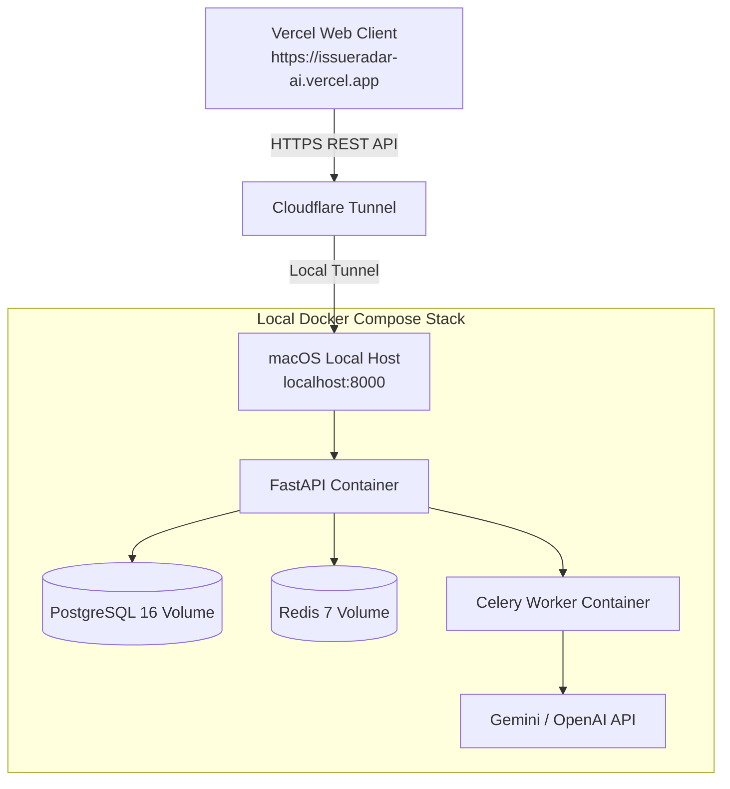

# IssueRadar AI (v1.0.0)

> An enterprise-ready, AI-powered platform that helps open-source contributors discover high-impact GitHub issues matching their skills, experience, and domain interests.

---

## 🌟 Architecture & Local Hybrid Deployment

IssueRadar AI is deployed using a **Hybrid Production Architecture**:

- **Frontend**: Deployed on **Vercel** (`https://issueradar-ai.vercel.app`)
- **Backend Stack**: Hosted locally on macOS (Apple Silicon M1/M2/M3) via **Docker Compose** (`api`, `postgres`, `redis`, `celery_worker`, `celery_beat`)
- **Public Tunnel**: Exposed to Vercel via **Cloudflare Tunnel** (`https://*.trycloudflare.com` or custom domain)



---

## 🛠️ Helper Execution Scripts

Use the pre-configured executable scripts in `scripts/` to manage the local stack:

```bash
# Start all containers in background and check health
./scripts/start.sh

# Inspect running container status and /health probe
./scripts/status.sh

# Stop all containers cleanly
./scripts/stop.sh
```

---

## 🌐 Cloudflare Tunnel Setup Guide

To connect your Vercel production frontend to your local M1 Mac backend:

### 1. Install Cloudflared

On macOS:

```bash
brew install cloudflared
```

### 2. Launch an Instant HTTPS Tunnel

Start the local stack and expose port `8000`:

```bash
./scripts/start.sh
cloudflared tunnel --url http://localhost:8000
```

`cloudflared` will generate a public HTTPS URL (e.g. `https://random-subdomain.trycloudflare.com`).

### 3. Update Vercel Environment Variables

- Set `VITE_API_BASE_URL` on Vercel to your Cloudflare URL:
  `VITE_API_BASE_URL="https://random-subdomain.trycloudflare.com"`
- Trigger a Vercel redeploy.

### 4. (Optional) Create a Named Persistent Cloudflare Tunnel

```bash
# Authenticate with Cloudflare
cloudflared tunnel login

# Create tunnel
cloudflared tunnel create issueradar-backend

# Configure routing in ~/.cloudflared/config.yml:
# tunnel: <Tunnel-UUID>
# credentials-file: ~/.cloudflared/<Tunnel-UUID>.json
# ingress:
#   - hostname: api.issueradar.ai
#     service: http://localhost:8000
#   - service: http_status:404

# Run named tunnel
cloudflared tunnel run issueradar-backend
```

---

## 🔐 GitHub OAuth Configuration for Hybrid Stack

When running behind Cloudflare Tunnel, register your OAuth Callback in **GitHub Developer Settings**:

- **Homepage URL**: `https://issueradar-ai.vercel.app`
- **Authorization Callback URL**: `https://<your-cloudflare-tunnel>.trycloudflare.com/api/v1/auth/callback`

---

## 🧪 Monorepo Verification & Quality Targets

```bash
make lint       # Run ESLint & Ruff code quality checks
make format     # Format codebase with Prettier & Ruff
make test       # Run full Pytest suite
make build      # Compile TypeScript and Vite production bundle
```

---

## 📄 License & Versioning

Released under the **MIT License**. Versioning follows [Semantic Versioning 2.0.0](https://semver.org/). See [CHANGELOG.md](file:///Users/harsha/Desktop/IssueRadar%20AI/CHANGELOG.md) for detailed version history.
